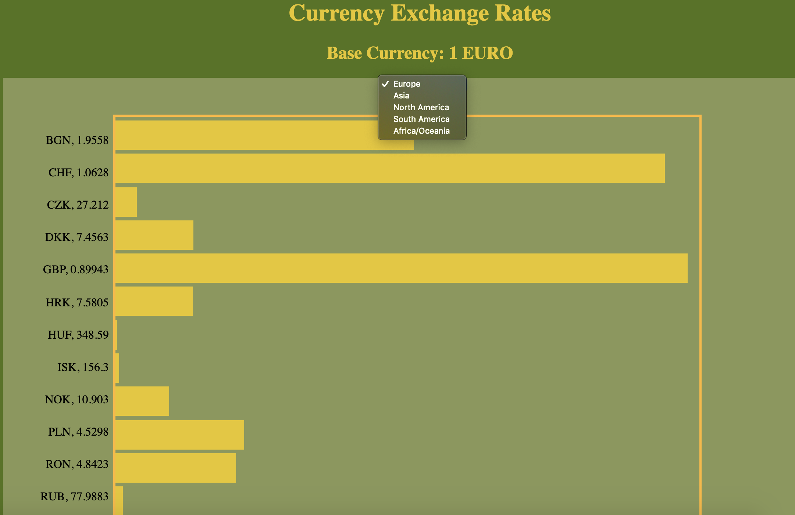

# Exchange Rate Data

## What it's about
This widget allows a user to check exchange rates of various countries in comparison to the EURO. 

## Data Package
* The data is fetched from an API, [Foreign Exchange Rates](exchangeratesapi.io).

* Current data displayed is calculated from [Latest Exchange Rates](https://api.exchangeratesapi.io/latest)

## Data Visualization Scheme

The data is displayed with a bar chart, allowing the user to select specific regions to view. The chart plots the bars in relation to the strength of the foreign currency to the EURO.

### Demo

